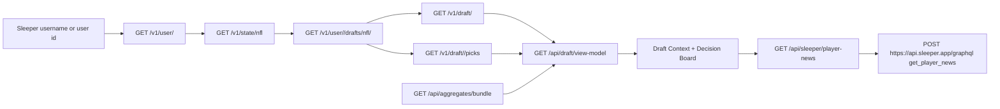

# Draft Assistant Runbook

Last updated: 2026-06-30

This is the working runbook for future draft-assistant prep. Keep practical notes here while testing real Sleeper drafts so the next seasonal pass can skip the browser/API learning curve.

## Goal

Use the draft assistant beside a live Sleeper draft room and verify three things:

- Sleeper user, draft list, draft details, and picks still load.
- Aggregate rankings render with source freshness visible enough to trust or distrust them.
- Draft-room state changes in Sleeper, especially draft slot and picks, appear in the assistant within the polling window.

## Fast Startup

1. Start the app:

   ```bash
   pnpm dev
   ```

2. Open the assistant:

   ```text
   http://localhost:3000/draft-assistant
   ```

3. Enter the Sleeper username, or deep-link once the user and draft are known:

   ```text
   http://localhost:3000/draft-assistant?userId=<sleeper-user-id>&draftId=<draft-id>
   ```

4. Open Sleeper in another Chrome tab while logged in:

   ```text
   https://sleeper.com/draftboards
   ```

## Sleeper API Checks

Use these public endpoints before assuming the app is broken:

```bash
curl https://api.sleeper.app/v1/state/nfl
curl https://api.sleeper.app/v1/user/<username>
curl https://api.sleeper.app/v1/user/<user-id>/drafts/nfl/<season>
curl https://api.sleeper.app/v1/draft/<draft-id>
curl https://api.sleeper.app/v1/draft/<draft-id>/picks
```

Sleeper's state endpoint is the source of truth for the active draft season. In June 2026 it returned `league_season: "2026"` and `season: "2026"`, while older completed 2025 drafts were still available separately. Do not silently fall back to 2025 when preparing for the new season.

## Sleeper Live-Draft API Graph

The live draft workflow uses Sleeper REST for authoritative draft state and Sleeper GraphQL only for on-demand player news. Use the cache-busted REST responses as the clock and pick source of truth; the visible board can be scrolled, visually ambiguous, or briefly stale.

What was actually explored on 2026-06-30:

- Multiple 2026 Sleeper mock drafts were created, claimed, started, paused/resumed, and completed or inspected after completion.
- The visible Sleeper draft UI was used for draft slot claiming, pause/resume, disabling auto-pick, searching players, queueing candidates, and drafting from the row action.
- Public Sleeper REST endpoints were queried repeatedly during live mocks and compared against the visible draft room.
- The app's local `/api/draft/view-model` endpoint was used during drafts to combine Sleeper state with aggregate rankings and recommendation context.
- Sleeper GraphQL was explored for `get_player_news` and implemented behind `/api/sleeper/player-news` for on-demand player detail enrichment.

What was not fully explored:

- We did not complete a full browser network-trace audit of every internal Sleeper live-room request, WebSocket, or GraphQL operation used by the Sleeper web app itself.

Update from 2026-07-11: Sleeper's loaded web bundle was inspected after the
`START DRAFT` control repeatedly froze Chrome. The room uses authenticated
GraphQL mutations at `https://sleeper.com/graphql`, including
`update_draft_status`, `remove_user_from_autopick`, and
`draft_pick_player`. The logged-in page's own action module can invoke these
without reading or copying cookies. This completed two full mocks without a
missed turn or auto-pick. Keep cache-busted REST as the authority: mutation
completion is not proof that the room reached the intended turn or status.

The reliable programmatic sequence is:

1. Claim a random slot and start the mock through the page's authenticated
   action.
2. Immediately set status to `paused` and remove the user from auto-pick.
3. Resume, poll `/v1/draft/<id>/picks`, and pause only when
   `picks.length + 1` belongs to the user slot.
4. Read `/api/draft/view-model` while paused and record the top recommendation.
5. Resume and submit `draft_pick_player(sport, draft_id, pick_no, player_id)`.
6. Verify the new REST pick before advancing.

Keep automation segments short. An eight-round browser call completed its page
actions but failed to return control for a long time, leaving the room hard to
observe. Prefer one turn per call, or at most a small bounded segment, even
when the page action itself polls and pauses correctly.



| Endpoint | When used | What it provides | Notes |
|---|---|---|---|
| `GET https://api.sleeper.app/v1/state/nfl` | Startup / season detection | Active NFL `season` and `league_season` | Use the active season; do not silently fall back to an old league season. |
| `GET https://api.sleeper.app/v1/user/<username>` | Username lookup | Sleeper `user_id`, username, display info | Used when the user types a username. |
| `GET https://api.sleeper.app/v1/user/<user-id>` | Direct-link startup | Same user identity shape | Used when `/draft-assistant?userId=...` is opened directly. |
| `GET https://api.sleeper.app/v1/user/<user-id>/drafts/nfl/<season>` | Draft selection | User draft summaries for that season | Empty `[]` is valid before the user's new-season drafts exist. |
| `GET https://api.sleeper.app/v1/draft/<draft-id>` | Live draft polling | Draft status, settings, rounds, teams, roster slots, scoring metadata, `draft_order`, `slot_to_roster_id` | Cache-bust with a timestamp and `cache: "no-store"`; fresh mocks can return `draft_order: null` before a slot is claimed. |
| `GET https://api.sleeper.app/v1/draft/<draft-id>/picks` | Live draft polling and pick verification | Full completed-pick list with `draft_slot`, `round`, `pick_no`, `player_id`, and pick metadata | Also cache-bust. `picks.length + 1` is the active pick while the draft is running. This is the best API verification after drafting a player. |
| `POST https://api.sleeper.app/graphql` with `X-Sleeper-GraphQL-Op: get_player_news` | Only after opening a player preview | Recent Sleeper news rows for one player | This is not in the public REST docs. Use on demand, not as a bulk live-draft fetch. |

Local app endpoints used during a live draft:

| Endpoint | Purpose |
|---|---|
| `GET /api/draft/view-model?draft_id=<draft-id>&user_id=<user-id>` | Main agent endpoint. Combines Sleeper draft details, picks, aggregate rankings, one canonical `recommendationBoard`, `draftContext`, available players, and user roster. |
| `GET /api/aggregates/bundle?...` | Loads ranking shards and source-health metadata for the draft room. This is static aggregate context, not live pick state. |
| `GET /api/aggregates/last-modified` | Quick freshness smoke check for aggregate data. |
| `GET /api/sleeper/player-news?playerId=<player-id>&limit=5` | Local wrapper around Sleeper GraphQL player news. Called only while a player preview is open. |

Implementation files:

| File | Responsibility |
|---|---|
| `src/lib/sleeper.ts` | User lookup, draft list lookup, NFL state, projections used by data refresh. |
| `src/lib/draftDetails.ts` | Cache-busted draft detail fetch. |
| `src/lib/draftPicks.ts` | Cache-busted pick fetch with lenient fallback for pre-draft/non-standard payloads. |
| `src/lib/draftState.ts` | Builds the shared view model, dynamic draft context, available groups, rosters, and recommendations. |
| `src/lib/sleeperNews.ts` | GraphQL `get_player_news` wrapper for on-demand player news. |
| `src/app/api/draft/view-model/route.ts` | Server-side combined live draft view model. |
| `src/app/draft-assistant/_lib/useDraftQueries.ts` | Client polling hooks for draft details and picks. |

## Mock Draft Workflow

For fast algorithm-only validation, use the script runner instead of opening
the mock UI:

```bash
pnpm run draft:algo-mocks -- --runs 10 --slot 5
```

This saves each completed draft under ignored `data/draft-results/...` with:

- `draft-result.json`: full Sleeper-shaped mock result artifact.
- `algorithm-decisions.json`: every user pick, top recommendation, shortlist,
  score profile, score components, roster counts, and remaining needs.

Optional Footballguys analysis can be run inline when a valid saved session env
is available:

```bash
pnpm run draft:algo-mocks -- --runs 3 --slots 1,5,10 --analyze --fbg-env data/footballguys-session.env
```

The Footballguys analyzer should grade drafts, not hide malformed ones. Use the
local algo mocks and quality gates to keep saved rosters complete; if a mock is
missing direct starters, FLEX coverage, or the intended 1QB/1TE/1K/1DEF shape,
fix the draft algorithm/tests first, then grade the saved result normally.

1. In Sleeper, go to Draftboards and create a new NFL mock draft.
2. Record the draft id from the URL:

   ```text
   https://sleeper.com/draft/nfl/<draft-id>?ftue=commish
   ```

3. Confirm the draft through the API. A fresh unstarted mock can return:

   - `status: "pre_draft"`
   - `season: "2026"`
   - `metadata.scoring_type: "std"`
   - `draft_order: null`
   - `slot_to_roster_id` present or null
   - no picks from `/picks`

4. Claim a draft slot in Sleeper before judging the assistant's turn math. After claiming Team 1, Sleeper should map the current user to slot 1:

   ```json
   { "<sleeper-user-id>": 1 }
   ```

5. Open the assistant deep link with the same user and draft id. Expected pre-draft display:

   - selected draft card shows the draft id and settings
   - draft status shows the claimed slot
   - current pick is `1.01`
   - picks count is `0/<teams * rounds>`
   - roster slots render empty
   - available and position tables render

6. Start the Sleeper draft and make one obvious pick. The assistant polls draft details and picks every 3 seconds, so the picked player should become drafted/dimmed shortly after Sleeper records the pick.

   In the 2026 mock, CPU autopick advanced the board quickly after the manual 1.01 pick. That is useful for stress-testing pick polling, but expect the draft state to move several picks between browser/API checks.

## Live Mock Controls

Pause the Sleeper room only when the active pick belongs to the user. Do not pause during bot picks: that freezes the available-player pool before the user's real turn. In the draft room, the top-right control/sliders icon opens the commish menu; use **Pause Draft** after the API identifies the user's active pick, and **Resume Draft** only after the player is isolated and ready to select.

Immediately after confirming `START DRAFT`, pause the room before inspecting the assistant or searching for a player. Then disable auto-pick and verify both states. Sleeper can force auto-pick on at draft start, and spending the first-turn clock debugging these controls has caused first picks to be auto-drafted. Treat any draft where control is not verified before the user's pick as a failed test and stop it.

Disable Sleeper user auto-pick immediately after starting or resuming a mock. The reliable control during testing was the pink banner's **TURN OFF AUTO-PICK** link. Clicking the `AUTO` badge near the team avatar was not reliable enough; missed turns at 3.05 and 6.06 happened because auto-pick was still enabled.

Use the Sleeper queue while waiting. Queue acceptable fallback players before the user's turn, then draft from the row action once on the clock. During this pass, double-clicking the left row action drafted the selected player reliably; a single click could only focus/change row state.

The most repeatable manual-pick flow in Chrome was:

1. Poll cache-busted draft details and picks. Let `activePick = picks.length + 1`.
2. Derive the active slot from the snake order. For `teams = N`, `round = floor((activePick - 1) / N) + 1` and `index = (activePick - 1) % N`; the slot is `index + 1` in odd rounds and `N - index` in even rounds.
3. Let bots continue while the active slot is not the user's `draft_order` slot. Pause only when the slots match, then verify the top banner says `Draft paused by commish.` and the detail endpoint says `status: "paused"`.
4. Refresh `/api/draft/view-model?draft_id=<draft-id>&user_id=<user-id>` and read the recommendation against the now-final available pool.
5. In Sleeper, type the selected player into the `Find player` search box so the table isolates one row.
6. Click the banner `RESUME` text with a DOM/text locator, not only by coordinate.
7. Double-click the visible `+`/row action for the isolated row.
8. Poll picks until the completed count increases and verify the new row has the expected `draft_slot`, `player_id`, and `picked_by`. Then let bots run to the next user turn before pausing again.

The row-action coordinate changes with Sleeper's table layout. In the one-row filtered view it was sometimes around y=459, not the lower y=489 used earlier. Always inspect the screenshot and click the visible row action, not a memorized coordinate.

Do not assume a pause attempt succeeded. The commish menu can remain open after the draft is already paused, and the draft API can still report `status: "drafting"` if the click missed. Before doing terminal research, either confirm the paused banner visually or check the cache-busted draft endpoint. If it still says `drafting`, make the pick immediately or pause again.

If the Sleeper tab freezes, blanks, times out, or Chrome reports the page is unresponsive, stop trying to revive that tab. Open the exact draft URL in a fresh Chrome tab first, confirm the room state there, and continue from the fresh tab. The reopened draft tab recovered the room state repeatedly in testing, while continuing to fight the frozen page wasted clock.

Keep the browser window visible and the Mac unlocked for live UI automation. Once the screen locked, direct UI control stopped and the remaining user-slot picks were made by Sleeper timer/auto-pick. If the machine is locked, use the public Sleeper picks API to reconstruct state, but do not assume the draft is still paused or controllable.

If the Chrome plugin is available, prefer it over the standalone CDP helper for an already-open logged-in Sleeper tab. The plugin can claim a matching Sleeper draft tab and exposes a tab-scoped `cdp` capability; this worked even when `$HOME/.agents/skills/chrome-cdp/scripts/cdp.mjs list` failed because Chrome did not expose a `DevToolsActivePort` WebSocket. Filter open tabs to known Sleeper/local draft URLs before claiming a tab, and keep the claimed tab open as the handoff surface for live draft work.

The standalone `chrome-cdp` helper is still useful, but it needs Chrome to expose a DevTools port. If `cdp.mjs list` cannot connect, either use the Chrome plugin path above or relaunch/configure Chrome with remote debugging before the draft. Do not wait until the clock is running to discover this.

## App Data Checks

The assistant depends on both live Sleeper API data and static aggregate shards.

```bash
curl 'http://localhost:3000/api/aggregates/last-modified'
curl 'http://localhost:3000/api/aggregates/bundle?scoring=std&positions=ALL,QB,RB,WR,TE,K,DEF,FLEX&limit=0'
curl 'http://localhost:3000/api/draft/view-model?draft_id=<draft-id>&user_id=<user-id>'
```

For aggregate freshness, inspect:

```text
public/data/aggregate/metadata.json
```

During the 2026 prep pass, the aggregate route worked but the source data was stale: FantasyPros metadata was Week 15 2025 and Tiers was dated December 2025. Projection/value fields were thin or missing in the UI, so working API routes did not mean the rankings were ready for a new draft season.

After refreshing FantasyPros on 2026-06-30, draft ECR worked for 2026 and rebuilt the app aggregate. Unauthenticated FantasyPros projection requests can return short registration-fenced pages, but a temporary Chrome-cookie-backed run succeeded for all projection combinations: QB/RB/WR/TE/K/DST across STD/HALF/PPR. Treat FantasyPros projected-point/value fields as usable only when `fetch-mode.json` says `projectionsFetched: true` and the projection row counts are complete. To attempt all-position projection scraping, run with a valid session cookie, e.g. `FP_COOKIE=... FP_FETCH_PROJECTIONS=true DRAFT=true pnpm run fetch:fp`; keep the cookie in a local env var or secret store only.

Tiers CSVs are generated locally for 2026 from the current FantasyPros draft ECR files. Run `pnpm run fetch:tiers` after refreshing FantasyPros; it writes tier raw CSV and metadata files for QB/RB/WR/TE/K/DEF/FLEX/ALL. The old S3 downloader remains available as `pnpm run fetch:borischen:remote` for manual comparison, but it should not be the default seasonal refresh path.

Check expert sample size before trusting weekly rankings. FantasyPros raw ECR files include the included/excluded expert IDs and counts; `pnpm run agg:combine` copies full ID lists into `public/data/aggregate/metadata.json` under top-level `expert_samples` and stores per-source summaries under `experts`. Early in a week, `experts.sample_size: "thin"` or `"limited"` means the ranking is structurally less reliable even if it is freshly fetched.

After rebuilding aggregates, snapshot the current source/player ratings into the local history DB:

```bash
pnpm run history:migrate
pnpm run history:ingest:aggregates
```

The initial ingest creates one version row for every tracked player/source/scoring/position value. Re-running the same aggregate ingest should create new `source_runs` but zero new `player_rating_versions`. New player rating versions should appear only when source values change. This is the data foundation for detecting players who are temporarily unranked during bye weeks instead of truly droppable.

## Decision Board Checks

The draft assistant now has a top-level Decision Board above the roster and position tables. During mock-draft validation, use this as the primary pick surface, then compare positional tables when the recommendation is close.

When using `/mock-draft`, the `Save result` action may visually land on a not-found-like response payload even though the draft artifact was written. Before rerunning a draft, check for the newest ignored `data/draft-results/<run>/draft-result.json` and any Footballguys summaries.

Before starting the Sleeper clock, capture a screenshot of the draft status and Decision Board. The status card should show source badges for Sleeper/FantasyPros/Tiers, while the Decision Board should show roster-construction label, open starter holes, open FLEX count, action labels, ADP delta, and reason chips.

For each user turn, record at least:

- top recommended player and rank on the Decision Board
- `VAL` score
- `take now`, `can wait`, or `queue fallback` action label
- ADP delta in rounds
- reason chips such as `Best value`, `Tier cliff`, `Likely gone`, `ADP bargain`, or `Roster need`
- any source-health warning visible in the Draft Status card

The player preview eye button should preserve the same draft-value context. Check that the dialog shows the same canonical `VAL` score, recent news, and source confidence or missing fields.

Future player-detail validation should treat the dialog as an agent-readable fact sheet, not just a ranking explanation. Useful context includes team/offense quality, role stability, bye-week overlap with the current roster, whether the pick solves a starter/flex/bench need, and the next few same-position alternatives with tier/comeback labels. The app does not need to answer every strategic question directly if this context is available in a structured way.

When proving the assistant was valuable, do not just list final picks. Capture moments where the app changed the decision: passing on a player with a `can wait` label, taking a player before a tier cliff, avoiding stale/degraded source data, or drafting for roster construction instead of static rank.

For local mock drafts, click `Save result` before starting post-draft review. The save route writes `draft-result.json` under ignored `data/draft-results/<timestamped-run>/`, including the simulator state, Sleeper-shaped draft details and picks, full player pool, all rosters, source health, and the draft view model. Put analyzer outputs such as `footballguys-slot-1-report.html`, `footballguys-slot-1-summary.json`, and `footballguys-all-teams-summary.json` in that same run directory so later review can compare what was visible during picks against the external final grade.

The mock draft room should reuse the same draft-assistant pick surface as the live draft assistant. Keep the setup form, simulator controls, and local draft board as mock-only scaffolding, but render the shared Draft Status, roster, Position Rankings, and Available Ranked Players sections for pick review. A separate mini decision board can make the simulator easier to build but less useful for practicing the real workflow.

The live UI, local mock, algorithm runner, saved artifact, and agent endpoint all consume the same normalized candidate shape and canonical `recommendationBoard`. A player without FantasyPros ECR remains visible for diagnosis but cannot become a recommendation. In 1QB/1TE builds, filled QB and TE slots are treated as complete; bench value should normally go to RB/WR.

Do not rely on one blended "best available" list alone. During a pick, compare at least three views:

- Best overall: useful for spotting true value and market drops, ideally sorted by overall ADP/value rather than positional rank.
- By position: useful for avoiding traps where QB1/TE1/K1/DEF1 look like global values and for checking starter-slot gaps.
- FLEX pool: useful for RB/WR/TE replacement decisions and for comparing bench/flex upside without polluting the answer with QB/K/DEF.

QB and TE need context. A top-tier QB or TE can be worth taking when the tier and price are right, but late-round projected-point spikes for backup QB/TE are often traps. Once the user has a viable starter at QB or TE, an additional QB/TE should require a visible reason such as elite tier value, very late draft cost, a superflex/TE-premium format, injury/bye contingency, or the absence of useful RB/WR/FLEX alternatives. This should be a soft decision aid, not a hard rule.

## 2026 Findings To Retain

- The official Sleeper docs still list the public user, draft, draft picks, and NFL state endpoints used by the app.
- `GET /v1/state/nfl` returned the active 2026 season before any new 2026 user drafts existed.
- `GET /v1/user/<user-id>/drafts/nfl/2026` can legitimately return `[]`; that is an empty current-season state, not an API failure.
- Pre-draft Sleeper mocks can return `draft_order: null`. The assistant must normalize this to `{}` so direct draft links render before a team is claimed.
- Claiming a Sleeper draft slot is necessary before testing "my turn", roster, and pick-distance logic.
- The assistant's local view-model can be healthy while ranking quality is not. Check source dates and field coverage before trusting advice.
- Sleeper can be current-season locally while still showing source-health nuance. In the 2026 refresh, all missing Sleeper projected-point rows were `ADP 999` historical/fringe player-universe rows, while draftable ADP rows had projections. Source-health coverage should therefore use a draft-relevant denominator, not all aggregate rows.
- Sleeper's public draft detail and picks endpoints are CDN-cached. During a live mock, response headers showed `s-maxage=15`, `stale-while-revalidate=300`, and `cf-cache-status: UPDATING`, which briefly made the public API return `pre_draft` and `[]` after the Sleeper UI was already drafting. Draft polling should cache-bust and use `cache: "no-store"`.
- The app can be on the right draft even when the selected draft card still says `pre_draft` for a few seconds. Confirm by comparing the `draftId` in the assistant URL and Sleeper URL, then wait for cache-busted polling or click refresh.
- A good smoke-check after starting a mock is `/api/draft/view-model?draft_id=<draft-id>&user_id=<user-id>`. It should show drafted players, the user's current roster, remaining roster requirements, and updated top available players.
- During live drafting, the visible Sleeper board is the source of truth for room ADP and pick availability. The app owns recommendation ranking and roster context through FantasyPros ECR plus live draft state.
- The local draft view-model route returns one `recommendationBoard`; the old `nextPickRecommendations`, `dynamicRecommendations`, and `/api/draft` paths were removed to prevent scoring drift.
- In the earlier 2026 10-team mock, the draft settings had 15 rounds and the UI roster table had bench slots, but the route's `rosterRequirements` reported `BN: 0`. That mismatch has since been fixed by deriving bench slots from draft rounds minus starter slots.
- FantasyPros can behave differently in Chrome and in the scheduled fetcher. Chrome showed full 2026 projection pages for QB/RB/WR/TE/K/DST across STD/HALF/PPR, while unauthenticated script requests returned 10-row registration-fenced pages for several combinations. Do not use a browser-visible full table as proof the scheduled scraper is safe.
- A completed manual mock proved the full flow from slot 5: the Sleeper API ended `status: "complete"` with 150 picks, and the assistant showed 15/15 rounds, all roster counters filled, and no starter holes.
- Final manual roster for that mock: Patrick Mahomes; Saquon Barkley, Derrick Henry, Josh Jacobs, Chuba Hubbard, Rachaad White; Brian Thomas, Courtland Sutton, Mike Evans, Marvin Harrison, Quentin Johnston; Sam LaPorta, George Kittle; Houston Texans DEF; Brandon Aubrey.
- The 2026 must-have implementation pass was revalidated against a completed local mock. The draft room showed source-health rows, the Decision Board, roster state, source confidence/reason chips, and the player preview with source rows, why-over-next comparison, history signal, and on-demand news.
- The known `BN: 0` mismatch is fixed in the shared view-model path: bench slots now come from `rounds - starter slots`, and extra drafted players reduce remaining `BN` after starter/flex slots are filled.
- Late-round bench policy is now part of draft-value scoring: 1QB redraft penalizes backup QB/K/DEF by default, delays K until the final pick, delays DEF until the final two rounds, and rewards RB/WR bench-upside picks while bench slots remain open.
- The draft view-model now returns `draftContext`, a compact agent-readable packet with room totals, total picks remaining, league-wide starter and bench slots remaining, the user's open starter/FLEX/bench slots, drafted-position counts, recent positional run, per-position outlook, and reusable draft questions. Use this before adding one-off strategy rules; it often gives enough context for an agent to reason about the next target.
- A restored original-pick-surface mock from slot 5 scored `A+` in Footballguys Rate My Team, but the position grades showed the strategic gap: RB starters/depth and TE were `A+`, while WR starters were only `C`. Treat this as evidence that the UI should keep overall value, by-position value, and RB/WR starter balance visible together.
- The strategy used for that `A+` restored-UI mock was deliberately simple: build from the shared assistant table, prefer RB/WR early, allow elite TE from round 3 and QB from round 4 when value/tier timing justified it, avoid backup QB/TE/K/DEF by default, push K/DEF to the final rounds, and add urgency for tier cliffs plus players unlikely to come back. The lesson is not that this exact policy is optimal; it is a repeatable baseline to beat.
- Table shorthand: `VAL` is the canonical tuned pick value score after FantasyPros ECR/tier value, roster fit, urgency, comeback timing, ADP timing, and strategy adjustments. Do not show a persistent comeback-probability column by default; timing should surface through `VAL`, ADP delta, and reason chips like `Likely gone`.
- Do not split the draft-clock UI into raw value versus recommendation score. Tune `VAL` as the single score over time, and keep the draft value baseline on FantasyPros ECR average (`rank_ave`) rather than projected points. If `rank_ave` is missing, expose it as missing data instead of falling back to another rank field.
- The 2026 slot-5 UI iteration showed two separate RB failure modes: WR/WR/TE starts can create obvious RB-starter weakness, and WR/WR/RB can still grade poorly if the round-two RB tier was close enough to take earlier. The current baseline should prefer a close RB anchor after opening WR, while still allowing elite TE once RB is represented.
- Team positional rank from TapThatDraft is not currently a default UI target. Position rank and ADP delta are more directly useful on the clock; the app already carries team/bye in the compact row.
- A final live validation used refreshed Sleeper/FantasyPros/tier data from slot 2. The user team took the assistant's top recommendation at all 15 turns, never entered auto-pick, completed every required roster slot, and received an `A-` independent grade. The saved picks, request, report, and summary remain under ignored `data/draft-results/`.
- That live roster was Ja'Marr Chase, Derrick Henry, Brock Bowers, A.J. Brown, D'Andre Swift, Joe Burrow, Terry McLaurin, Jadarian Price, Marvin Harrison, Aaron Jones, Jacory Croskey-Merritt, Michael Pittman, Jordan Mason, Houston Texans DEF, and Brandon Aubrey. Its construction matched the intended policy: fill core RB/WR starters, allow tier-one TE/QB windows, use the bench for RB/WR depth, then take DEF and K in the final two rounds.
- Later live testing added two generic timing rules: an early QB/TE must be position tier 1 and at or past FantasyPros ECR, and an elite QB should not jump an open RB2/WR2 merely because of its positional tier. Ten-slot local batches passed after these changes, with core RB/WR starters filled before QB and no backup-QB/TE detours.
- The FP-only algorithm completed three consecutive live Sleeper mocks at `A+`, `A+`, and `A` from slots 4, 8, and 6 on 2026-07-11. Every user pick was the current top recommendation, auto-pick stayed off, and each run ended with 150 verified picks. Full boards, canonical imports, per-pick recommendation logs, and reports remain under ignored `data/draft-results/`.
- For reliable Chrome control, execute one user turn per bounded action: resume the room, poll cache-busted picks until `picks.length + 1` maps to the user's snake-order slot, pause, fetch `/api/draft/view-model`, submit that player through Sleeper's authenticated page action, and verify the exact pick in REST. Use a 25-second wait timeout that pauses before failing. After the final user pick, resume once and require 150 picks plus `status: complete` before saving artifacts.

## Current Rough Edges

- Source freshness is not prominent enough in the draft room. The app should show per-source freshness and missing-field coverage, not only a broad aggregate timestamp.
- The available pool is effectively limited by ranked rows in parts of the view model; unranked current-season players need clearer handling.
- FantasyPros projected points/value fields can exist in the aggregate, but draft recommendations should not depend on them. The schedule-safe draft path is ECR-only; missing FantasyPros projections should not create draft-room source warnings when ECR/tier data is healthy.
- Starting a Sleeper mock can trigger a browser confirmation dialog. If automation hangs there, verify draft status through `GET /v1/draft/<draft-id>` before continuing.
- Kicker and defense recommendations can be inflated by stale or invalid player/team data. In the completed mock, the final auto-picked kicker had no current team, so late K/DEF choices need live-room validation.
- Footballguys can accept and resolve every roster player, then fail only while generating the report with a generic server-side 400. Retry once with unique league and team names before treating that as a grading failure; this recovered the final live validation report.
- For long automated Sleeper mocks, split browser execution into bounded halves. A single 15-round browser-control call can exceed five minutes and reset the control session even while Sleeper remains safely paused. After a timeout, verify cache-busted pick count and draft status, reclaim the exact draft tab, and resume from the current turn rather than restarting.
